# Adding New Systems and System Images

## Included System Image Packs

You may download one of the image packs that will change how the collection list looks. Download the zip file, which includes a folder of .png files, a CollectionData.qml file, and a CollectionItem.qml file.

- delete and replace the .png files in `/assets/images/devices/`
- replace `/components/resources/CollectionData.qml`
- and `/components/collectionList/CollectionItem.qml`

|theme|dreamcast|ngpc|pcengine|snes|
|-----|---------|----|--------|----|
|original [centered](.meta/extra-devices/original-centered.zip?raw=true) [offset](.meta/extra-devices/original-offset.zip) 33&nbsp;files|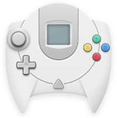|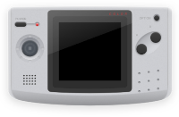|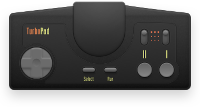|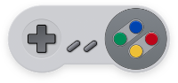|
|[pixel](.meta/extra-devices/pixel.zip?raw=true) 71&nbsp;files|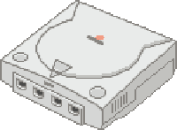|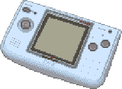|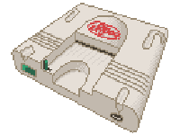||
|[br1ans](.meta/extra-devices/br1ans.zip?raw=true) 58&nbsp;files|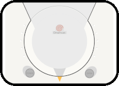|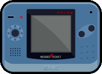|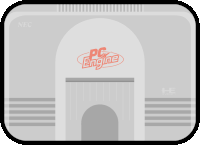|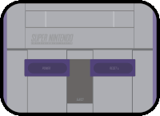|
|[clusterm](.meta/extra-devices/clusterm.zip?raw=true) 54&nbsp;files|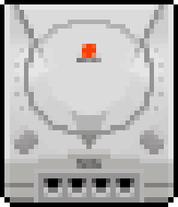|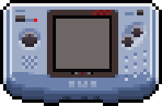|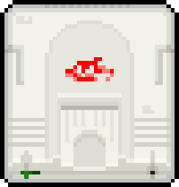|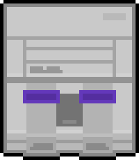|

---

## Alternate Files
Additionally, there are some zip files including some images I chose not to use from each of the themes. Mostly some of the more obscure systems that aren't in the metadata. You can check them out if you're missing something that you want to use.

- [br1ans-alt](.meta/extra-devices/br1ans-alts.zip?raw=true)
- [clusterm-alt](.meta/extra-devices/clusterm-alts.zip?raw=true)
- [pixel-alt](.meta/extra-devices/pixel-alts.zip?raw=true)

---

## Create Your Own

- add image files into `/assets/images/devices/shortname.png`
    - images should not have any padding, but can be worked around if it does
    - images may include dropshadow, or the shadow can be generated in the theme
    - images are *not required* for a collection to work
- add new metadata into `/components/resources/CollectionData.qml`
    - this metadata is *not required* for a collection to work
    - [alias](https://github.com/plaidman/retromega-next/blob/main/components/resources/CollectionData.qml#L32) notes
        - this defines alternate shortnames for systems
        - useful if a collection can be known by multiple shortnames, like dc/dreamcast
    - [metadata](https://github.com/plaidman/retromega-next/blob/main/components/resources/CollectionData.qml#L78) notes
        - color: background color for the collection page
        - vendor: name of the manufacturer
        - year: years of production
        - image: alternate image from a different collection
            - useful if multiple collections share an image, like arcade/atomiswave
        - any of these bits of metadata *may be excluded*, and the collection will still work
- adjust `/components/collectionList/CollectionItem.qml` if necessary
    - you can adjust the image sizes [here](https://github.com/plaidman/retromega-next/blob/main/components/collectionList/CollectionItem.qml#L99-L100)
        - useful if you are using images that have padding or dropshadows.
    - you can uncomment the DropShadow element [here](https://github.com/plaidman/retromega-next/blob/main/components/collectionList/CollectionItem.qml#L115-L123) if your image doesn't include dropshadows.
        - also it's best to set the Image element [here](https://github.com/plaidman/retromega-next/blob/main/components/collectionList/CollectionItem.qml#L105) to invisible to prevent the image from drawing twice
    - you can also adjust the smoothing on image resizing [here](https://github.com/plaidman/retromega-next/blob/main/components/collectionList/CollectionItem.qml#L104)
        - setting it to false is good for pixelated themes, so pegasus doesn't try to smooth out the pixelly goodness
